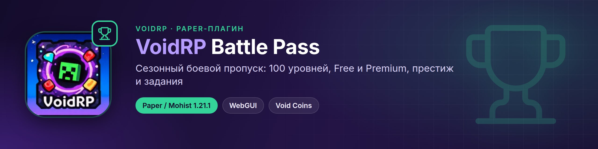
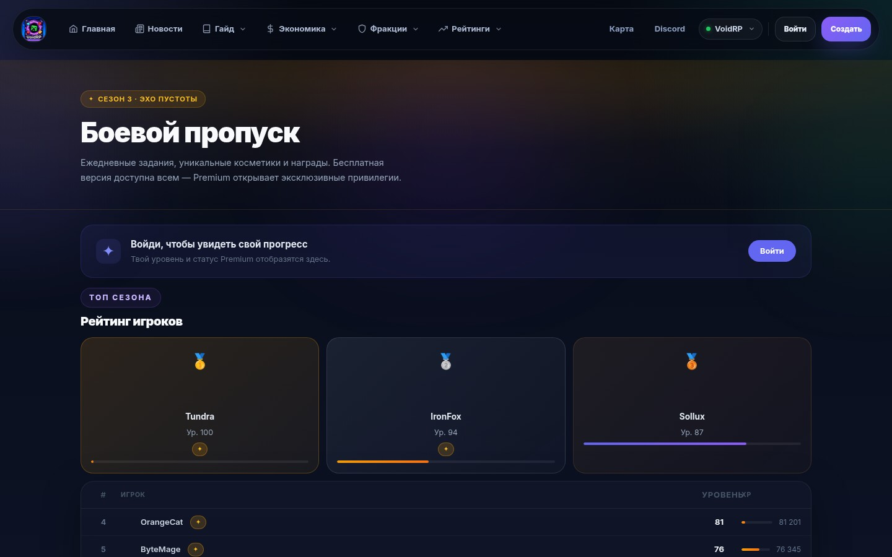
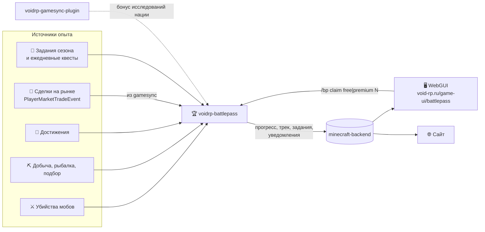
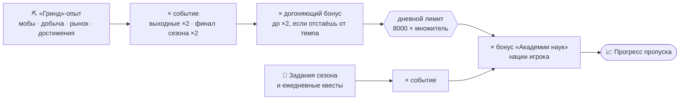

<p align="center"></p>

<div align="center">


[](https://github.com/VOIDRP-MINECRAFT/voidrp-battlepass/actions/workflows/build.yml)


</div>

> Paper-плагин сезонного боевого пропуска VoidRP: Free/Premium-треки на 100 уровней, престиж после сотого,
> задания сезона, награды предметами, деньгами и Void Coins, интерфейс в WebGUI поверх игры.

---

## 📸 Как это выглядит

<table>
<tr>
<td width="50%"><br><sub>В игре: трек наград Free / Premium и задания дня</sub></td>
<td width="50%"><br><sub>На сайте: рейтинг сезона</sub></td>
</tr>
</table>

<sub>Страницы [voidrp-site](https://github.com/VOIDRP-MINECRAFT/voidrp-site) на демо-данных; в игре пропуск открывается через WebGUI.</sub>

---

## 🗺️ Место в экосистеме



---

## ✨ Возможности

### Прогресс
- **100 уровней** по 10 000 XP (`xp-per-level`, применяется на лету по `/bpadmin reload`).
- **Престиж** — после 100-го уровня опыт продолжает копиться: каждый уровень престижа даёт **50 Void Coins**.
- **Два трека**: Free и Premium (право `voidrp.battlepass.premium`, статус хранится на бэкенде).
- Награды: предметы, деньги (Vault), команды (модовые предметы через `/minecraft:give`), **Void Coins**.

### Баланс опыта



- «Выходные» и «финал» (последние 7 дней сезона) перемножаются; вместе с множителем растёт и дневной лимит.
- Догоняющий бонус включается, если уровень игрока ниже 70% от ожидаемого на этот день сезона.
- Задания и квесты идут мимо дневного лимита — они ограничены сами по себе.
- Опыт от предметов и достижений из только что забранной награды не засчитывается.

### Интерфейс
- `/bp` открывает боевой пропуск в **WebGUI** (страница сайта поверх игры); без WebGUI — классическое меню-сундук.
- NPC «Хранитель Сезона» открывает то же меню.
- Уведомление в HUD о новом уровне, напоминание о незабранных наградах при входе.

---

## ⌨️ Команды

| Команда | Кому | Что делает |
|---|---|---|
| `/bp` (`/battlepass`, `/баттлпасс`) | игрок | Открыть боевой пропуск |
| `/bp quests` | игрок | Задания сезона |
| `/bp info` | игрок | Уровень, опыт, трек |
| `/bp claim <free\|premium> <уровень>` | игрок (из WebGUI) | Забрать награду |
| `/bpadmin premium · xp · level · info · season · syncbackend` | `voidrp.battlepass.admin` | Администрирование |
| `/bpadmin reload` | `voidrp.battlepass.admin` | Перечитать конфиг без рестарта |

---

## 📋 Требования

| Компонент | Версия |
|---|---|
| Paper / Mohist | 1.21.1 |
| Java | 21 |
| Vault, LuckPerms, VoidRpGameSync, VoidRpDailyQuests | soft-depend |

---

## 🚀 Сборка

Плагин компилируется против собранного jar `voidrp-gamesync-plugin`
(`../voidrp_gamesync_plugin/build/libs/*-all.jar`), поэтому репозитории кладутся рядом — так же делает CI:

```bash
git clone https://github.com/VOIDRP-MINECRAFT/voidrp-gamesync-plugin voidrp_gamesync_plugin
git clone https://github.com/VOIDRP-MINECRAFT/voidrp-battlepass voidrp_battlepass
(cd voidrp_gamesync_plugin && ./gradlew shadowJar)
(cd voidrp_battlepass && ./gradlew build)
```

---

## ⚙️ Конфигурация

`plugins/VoidRpBattlePass/config.yml`:

```yaml
season-name: "Осенний сезон 2026"
season-start: "2026-08-31"
season-end: "2026-11-29"
daily-xp-cap: 8000          # 0 — без лимита
# xp-per-level: 10000      # по умолчанию, если не задано
battlepass-npc-names:
  - "§6§lХранитель Сезона"
backend-url: "https://api.void-rp.ru"
game-auth-secret: ""        # X-Game-Auth-Secret этого сервера
webgui:
  enabled: true
  battlepass-url: "https://void-rp.ru/game-ui/battlepass"
```

Награды уровней — в `rewards.yml` (типы `ITEM`, `MONEY`, `COMMAND`, `VOIDCOIN`).

---

## 🔗 Связанные репозитории

| Репо | Связь |
|---|---|
| [minecraft-backend](https://github.com/VOIDRP-MINECRAFT/minecraft-backend) | Premium-статус, прогресс, трек и задания для WebGUI (`/battlepass/*`, `/game-sync/battlepass/*`) |
| [voidrp-gamesync-plugin](https://github.com/VOIDRP-MINECRAFT/voidrp-gamesync-plugin) | `PlayerMarketTradeEvent`, исследования наций, Void Coins |
| [voidrp-daily-quests](https://github.com/VOIDRP-MINECRAFT/voidrp-daily-quests) | Опыт за ежедневные квесты |
| [voidrp-site](https://github.com/VOIDRP-MINECRAFT/voidrp-site) | Страница `/game-ui/battlepass` и прогресс на сайте |

---

<div align="center">
<a href="https://void-rp.ru">🌐 Сайт</a> ·
<a href="https://github.com/VOIDRP-MINECRAFT">🏠 Организация</a>
</div>
